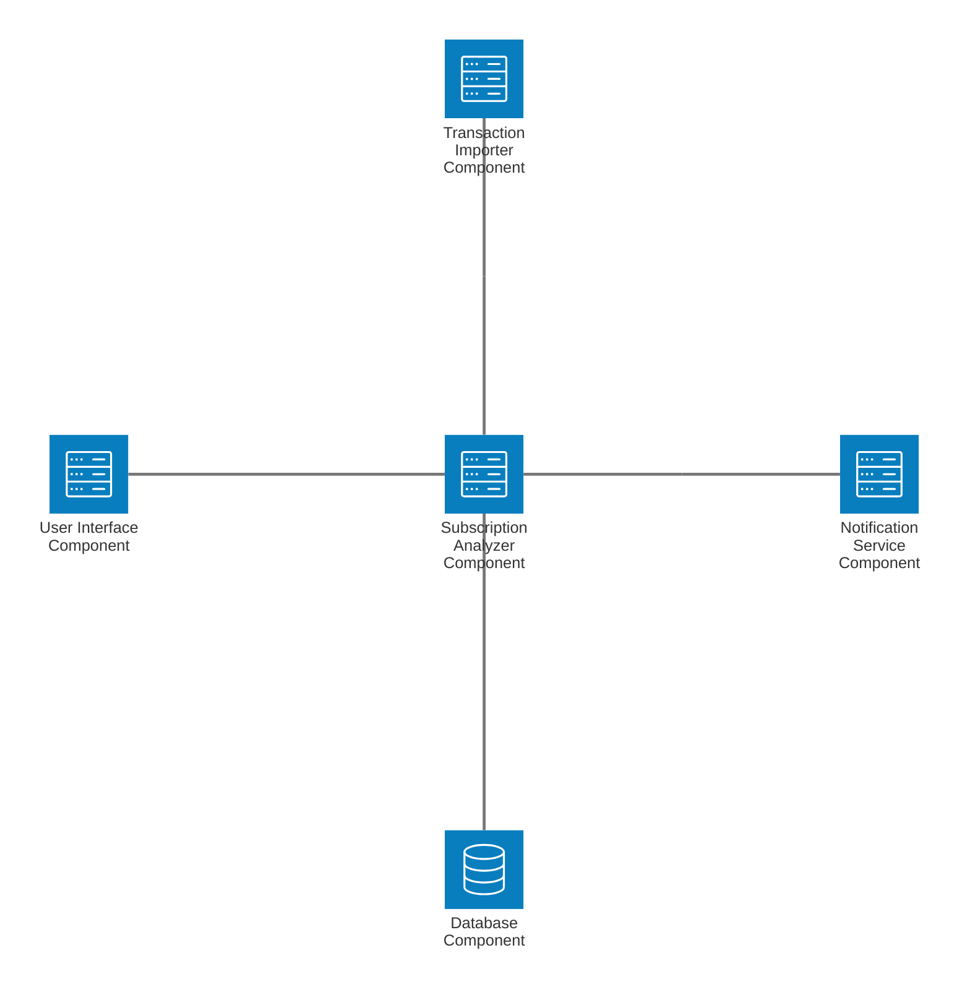

# PSREA UML Component Diagram
You can copy this Mermaid diagram code and paste it into [draw.io](https://app.diagrams.net/) (Arrange > Insert > Advanced > Mermaid) or the [Mermaid Live Editor](https://mermaid.live/) to export your final diagram as PNG or PDF.

> **Note**: Mermaid's standard syntax doesn't fully support the UML ball-and-socket notation perfectly without manual SVG tweaking. Since draw.io has built-in UML tools, you may want to use those native tools to drag-and-drop the 5 components (rectangles with `<<component>>`) and 4 ball-and-socket connectors directly. 

### Instructions for Draw.io (Preferred for accurate ball-and-socket)
1. Search for "UML" in Draw.io shapes.
2. Drag 5 **Component** rectangles. Name them:
   - User Interface Component
   - Transaction Importer Component
   - Subscription Analyzer Component
   - Notification Service Component
   - Database Component
3. Drag 4 **Provided/Required Interface** (ball and socket) connection lines:
   - Connect **User Interface** (socket) to **Subscription Analyzer** (ball). Label: `Display Subscription Burn Rate`
   - Connect **Subscription Analyzer** (socket) to **Transaction Importer** (ball). Label: `Request/Receive Data`
   - Connect **Subscription Analyzer** (socket) to **Notification Service** (ball). Label: `Trigger Renewal Alert`
   - Connect **Subscription Analyzer** (socket) to **Database** (ball). Label: `Persist Configs/Data`
